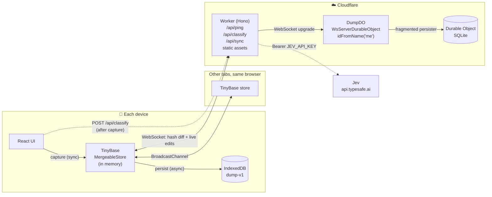
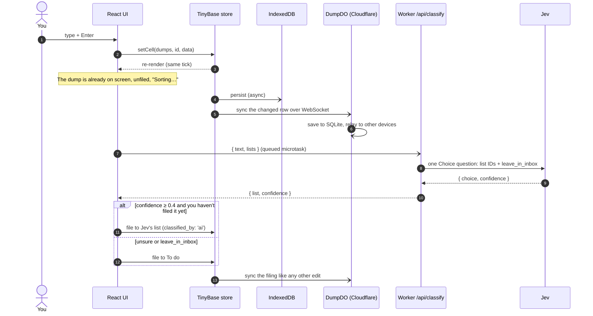
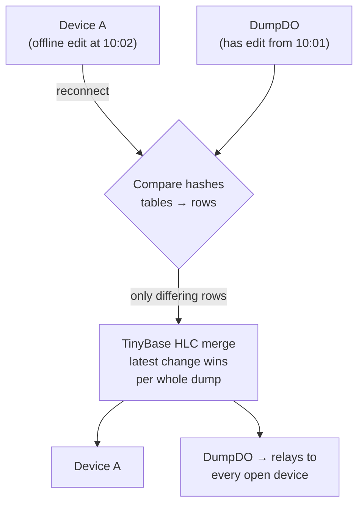
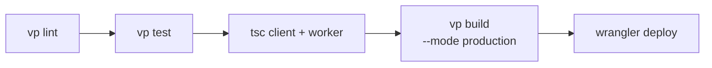

<p align="center">
  
</p>

<h1 align="center">Dump</h1>

A capture-first home for thoughts and links. Type something, press Enter, and it is saved. Organizing it can wait, and with [Jev](#why-jev) switched on the app files it for you.

Dump is built for one person using one device at a time. It is **local-first**: every capture lands on your device right away, then syncs to other devices through a single Cloudflare Durable Object.

> **Public deployment.** There is no login. Anyone who can reach the hostname reads and writes the same data store. This is a deliberate product decision for a personal app; see [Security model](#security-model) before deploying your own copy.

- [Quick start](#quick-start)
- [Using Dump](#using-dump)
- [Architecture](#architecture)
- [Why these decisions](#why-these-decisions)
- [Why Jev](#why-jev)
- [Deploy to Cloudflare](#deploy-to-cloudflare)
- [Checks and tests](#checks-and-tests)
- [Limitations and roadmap](#limitations-and-roadmap)

## Quick start

Requires Node.js 22.12+ (tested with Node 24) and npm.

```bash
npm install
npm run dev
```

Open http://localhost:6191. That one process runs the React client, the Worker, and the Durable Object. Local data lives in this browser and in `.wrangler/state`. It is not your production data.

To turn on automatic filing locally, add your Jev key to `.env.local` (gitignored):

```bash
echo "JEV_API_KEY=your-key" >> .env.local
```

## Using Dump

| Action | How |
| --- | --- |
| Capture | Type and press Enter. Shift+Enter adds a new line. `/` focuses the composer. |
| File while capturing | Start with `!list`, for example `!buy warm floor lamp #reading` files to Buy and adds the tag `reading`. |
| Default lists | `!ideas`, `!buy`, `!watch`, `!decor`, `!todo`. For list names with spaces, use hyphens: `!weekend-plans`. |
| Auto-file | With Jev on, other dumps show "Sorting…" briefly, then move to Jev's pick, or to To do when Jev is unsure. If you file a dump first, your choice wins. |
| Search | Ctrl/Cmd+K searches thoughts, links, tags, lists, and navigation. |
| Sort the inbox | `1`–`9` pick a list, Right Arrow skips, Backspace removes. |
| Lists | Create them from the sidebar. Rename, recolor, or delete one with the pencil in the list header. |
| Done / remove | Final: there is no undo. Removal leaves a hidden tombstone so other devices don't bring the dump back. |
| Backups | Settings → Export or Import JSON. Import only adds missing records and never overwrites existing ones. |

Every view works like a chat: a header, the dumps (newest at the bottom), and the composer pinned underneath. `/marketing` is a separate landing page that doesn't load the notebook.

## Architecture

### The big picture



There are three layers, and each one can fail without taking the ones before it down:

1. **Memory.** The capture handler writes to the TinyBase store and the UI updates in the same tick. It never waits on disk or the network.
2. **Device.** IndexedDB saves the store asynchronously, so a reload keeps your data even when offline. A failed save shows an error; it is never hidden.
3. **Cloud.** A WebSocket connects the device to one Durable Object. It carries changes both ways and saves them to SQLite.

### What happens when you press Enter



If the request fails or you close the tab mid-request, the dump simply stays unfiled. **Unfiled open dumps are the retry queue.** They are sent again on the next load or reconnect, at most three at a time.

### Sync and conflicts



- **Each dump is one atomic JSON cell.** A dump's list, done flag, and provenance merge together, so a conflict picks one whole version and never mixes fields from two edits.
- **TinyBase's hybrid logical clocks decide who wins.** `updated_at` is display metadata only and never competes with the merge clock.
- **Nothing is physically deleted.** Removal sets `deleted: true`, a tombstone that syncs like any edit. Without it, an older copy would bring the dump back.
- **The server doesn't read rows.** It stores and relays them. Every client decodes rows with Zod in `readRows` (`src/shared/merge.ts`) and skips any that fail.

### Code map

```
src/
├── shared/            imported by both client and Worker
│   ├── schema.ts      Zod codecs for dumps, lists, backups; TinyBase table schema
│   ├── merge.ts       store factory, readRows (validated decode), sync tuning
│   ├── classify.ts    Jev request/response mapping, threshold
│   └── api.ts         typed API contract (Hono RPC)
├── client/            React app
│   ├── store.ts       local state, IndexedDB, WS + tab sync, domain commands, autoFile
│   ├── classify.ts    calls /api/classify
│   ├── App.tsx        notebook shell
│   ├── Marketing.tsx  lazy landing page
│   └── components/    cards, search, list editor, settings; ui/ = shadcn/Radix
└── server/            Cloudflare Worker
    ├── index.ts       Hono routes, origin checks, security headers, Jev proxy
    ├── dump-do.ts     DumpDO (TinyBase WsServerDurableObject + SQLite persister)
    └── env.ts         bindings; jevKey()
tests/                 Vitest unit tests + Playwright e2e
```

The client and Worker compile separately (`tsconfig.client.json`, `tsconfig.json`). Browser code imports the shared API contract but never Worker implementation types.

## Why these decisions

| Decision | Why | Trade-off accepted |
| --- | --- | --- |
| **Local-first, synchronous capture** | Capture is the whole product. A thought typed in a tunnel or on bad Wi-Fi must appear right away and survive a reload. | Each device has its own copy, so "saved here" and "synced" are shown as separate states. |
| **TinyBase MergeableStore** | CRDT-style merging with hybrid logical clocks is built in, along with IndexedDB and Durable Object persisters and a WebSocket synchronizer. Nothing had to be built by hand. | It merges whole records, not text. Two edits to the same dump pick one winner and never merge character by character. |
| **Built-in WebSocket sync, not a custom protocol** | Peers compare hashes and send only the rows that differ, and live edits reach every open device. An earlier version sent HTTP snapshots and polled; each poll sent the whole store and eventually hit a size limit. | WebSockets are required. There is no HTTP fallback, so changes stay on the device until a working network is available. |
| **One Durable Object (`idFromName('me')`)** | There is one user and one dataset, so one DO is the natural fit. It has strongly consistent SQLite storage, hibernating WebSockets, and no separate database to run. | It doesn't scale to multiple users. That's intentional: no accounts, tenants, D1, Postgres, or KV. |
| **Atomic JSON cell per dump** | Filing and its provenance (`classified_by`) must always change together. | The whole dump is rewritten on every edit, which is fine at this scale. |
| **Tombstones, never `delRow`** | A deleted row would come back from any copy that still has it. | Tombstones accumulate. Compaction needs a deliberate design first. |
| **Latest change wins, including offline edits** | The owner uses one device at a time. Precedence rules and revision checks would add complexity with no real benefit here. | A stale offline device can overwrite a newer change to the same dump. |
| **No undo** | Done, filing, and remove are final. Earlier undo logic could restore unrelated fields and conflicted with sync. | Mistakes are fixed by hand. Removal has a confirm step where it matters (Clear done, delete list). |
| **Validate on read, not on the server** | The sync server relays rows it doesn't understand, which keeps it simple. Clients use Zod to reject malformed data. | A bad row is skipped rather than rejected at the source. |
| **Hono on Workers + Cloudflare Vite plugin** | One `npm run dev` runs client, Worker, and DO together. Hono provides a small typed RPC contract. | Tied to Cloudflare's runtime. |
| **No authentication (for now)** | This is a personal tool, and the owner deferred auth on purpose. | Anyone who has the URL has full access, and the classify route spends your Jev key. See [Security model](#security-model). |

## Why Jev

[Jev](https://typesafe.ai/blog/introducing-system-one-models-and-jev) is TypeSafe's System One model. Instead of generating text, it answers **constrained questions** such as "which of these options?", and it returns a confidence score with each answer.

That fits Dump's main AI rule: **AI may file, never rewrite.**

| Need | Why Jev fits |
| --- | --- |
| Never change the user's words | Jev can't generate text. It can only choose from the keys we send (list IDs + `leave_in_inbox`). |
| Structured, parseable output | The answer is always one of our IDs plus a confidence. There is no prompt parsing and no JSON repair. |
| Know when it's unsure | The confidence score drives the fallback. Below `CLASSIFY_THRESHOLD` (0.4) the dump goes to To do. |
| Fast enough to feel instant | In live testing it answered in about 400 ms (948 ms cold), and it runs after capture, so it never blocks Enter. |
| Allow "none of these" | `leave_in_inbox` lets Jev decline instead of forcing a bad match. |

**Why a Worker proxy?** Jev's CORS policy rejects browser origins, and the API key must never ship in the bundle. `POST /api/classify` is stateless. It validates `{ text, lists }`, forwards one Choice question, checks the answer against the lists it sent (a list could be deleted during the request), and returns `{ list, confidence }`.

**Why is it optional?** Jev is on exactly when `JEV_API_KEY` is set. Without the key, or with fewer than two lists, dumps stay in the inbox for you to sort, and `/api/ping` reports `classify: false`. `--mode test` builds never call Jev.

**Why does the threshold sit at 0.4?** In early tests, correct Buy/Decor picks came back at 0.60–0.65 confidence. Jev's top pick still beats the To do fallback when it's somewhat unsure. The threshold should be tuned against real labelled dumps.

## Deploy to Cloudflare

Production target: `https://dump.abishrestha.com.np`. The steps below also work for your own fork.

### Prerequisites

- A Cloudflare account. SQLite-backed Durable Objects are available on the Workers Free plan; check current limits for your usage.
- For a custom domain, a zone (domain) already added to that Cloudflare account.
- Node.js 22.12+ and `npm install` completed.

### 1. Sign in

```bash
npx wrangler login
```

```bash
npx wrangler whoami
```

`whoami` prints your account ID.

### 2. Point `wrangler.jsonc` at your account and domain

Forks must change these fields:

```jsonc
{
  "name": "dump",
  "account_id": "<your account id>",
  "routes": [{ "pattern": "dump.example.com", "custom_domain": true }],
  "workers_dev": false,
  "preview_urls": false,
}
```

- **Custom domain (recommended):** set `pattern` to a hostname on a zone you own. Cloudflare creates the DNS record and certificate on deploy.
- **No domain yet:** remove `routes` and set `"workers_dev": true`. The app is then served at `https://dump.<your-subdomain>.workers.dev`.

Leave the `durable_objects` binding and the `migrations` entry (`new_sqlite_classes: ["DumpDO"]`) as they are. They create the SQLite-backed Durable Object class on first deploy.

### 3. Optional: enable Jev

```bash
npx wrangler secret put JEV_API_KEY
```

Paste the key when prompted. It is stored as an encrypted Worker secret and never reaches the browser. To turn classification off later:

```bash
npx wrangler secret delete JEV_API_KEY
```

### 4. Deploy

```bash
npx vp run deploy
```

The `deploy` task (under `run.tasks` in `vite.config.ts`) always runs, in order:



If any step fails, the deploy stops. Never deploy a `--mode test` build by hand: test builds swap out Jev and use isolated storage. The deploy script always rebuilds for production.

### 5. Verify

```bash
curl https://dump.example.com/api/ping
```

The expected response is `{"ok":true,"mode":"cloud","classify":true}`, with `classify` set to `false` when no key is configured. Then check the following:

- Capture on your phone and confirm it appears on your desktop without a reload.
- Turn on airplane mode, capture, reload (the dump is still there), reconnect (it syncs).
- With Jev on, a new dump shows "Sorting…", then moves into a list.
- Watch logs with `npx wrangler tail`. Observability is enabled in `wrangler.jsonc`.

After a deploy, reload open clients and installed PWAs through the update notice so they pick up the new build.

### Security model

The deployment has no application authentication. Anyone with the URL can read, edit, and delete your dumps, and can call `/api/classify`, which spends your Jev key. That route has only a coarse per-isolate limit of 60 requests a minute. The Worker rejects cross-origin API requests and requires an `Origin` on POSTs. It also sets `nosniff`, `no-referrer`, and `X-Frame-Options: DENY`.

If you need privacy, put the hostname behind [Cloudflare Access](https://developers.cloudflare.com/cloudflare-one/applications/configure-apps/self-hosted-apps/) (Zero Trust, free for small teams). It adds a login at the edge without any code changes.

## Checks and tests

```bash
npm run check
```

`check` runs the format check, lint, unit tests, type checks, and a production build.

```bash
npx playwright install chromium
```

```bash
npm run test:e2e
```

The e2e suite builds a local-only test build on port 6192 with isolated `.wrangler/test-state` storage. Its tests stand in for `/api/classify` instead of calling Jev.

Tooling is [Vite+](https://viteplus.dev): Vite, Vitest, Oxlint, and Oxfmt are all configured in `vite.config.ts`.

Other scripts: `npm run format` (`vp fmt`), `npm run lint` (`vp lint` + React Doctor), `npm test` (`vp test`), `npm run typegen` (regenerate Worker binding types).

## Limitations and roadmap

These are true today:

- Sync requires WebSockets. On networks that block them, changes stay on the device until you connect elsewhere.
- Simultaneous edits to the same dump pick one whole winner; there is no collaborative text editing.
- Local dev and production are different origins with separate data. Use Export/Import to move data between them.
- Import is additive: it restores missing IDs and never rewinds existing records, so it is not a full disaster-recovery tool.
- There is no schema versioning yet (the app hasn't reached a stable release), so formats change in place.

Not built yet: list reordering UI, card drag/manual order, list archiving, AI tagging, durable server-side AI jobs, scheduled digest, email capture, R2 backup/restore, link unfurling, advanced gestures, native share extension, and physical-phone validation.

Coding assistants should read [AGENTS.md](AGENTS.md).
