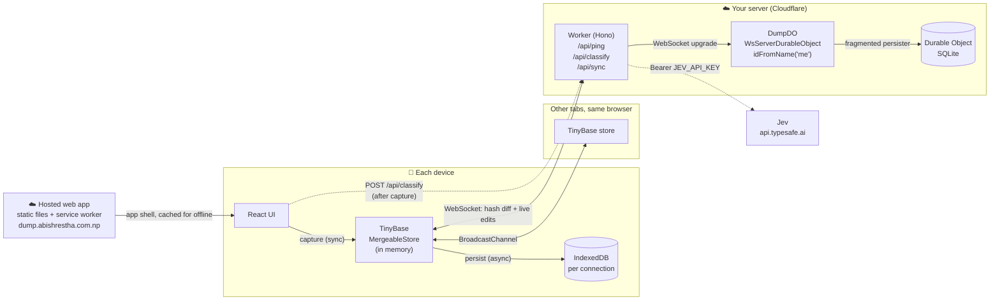
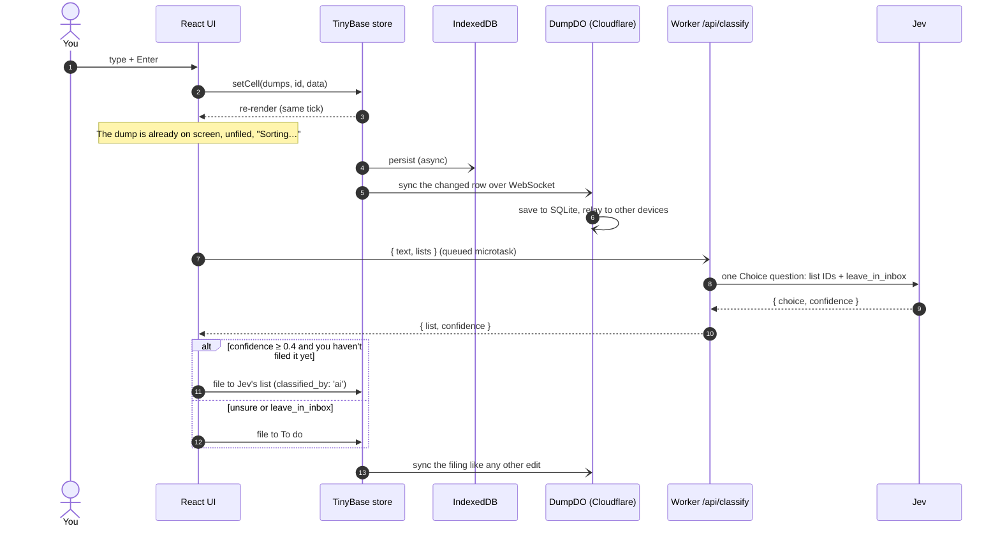
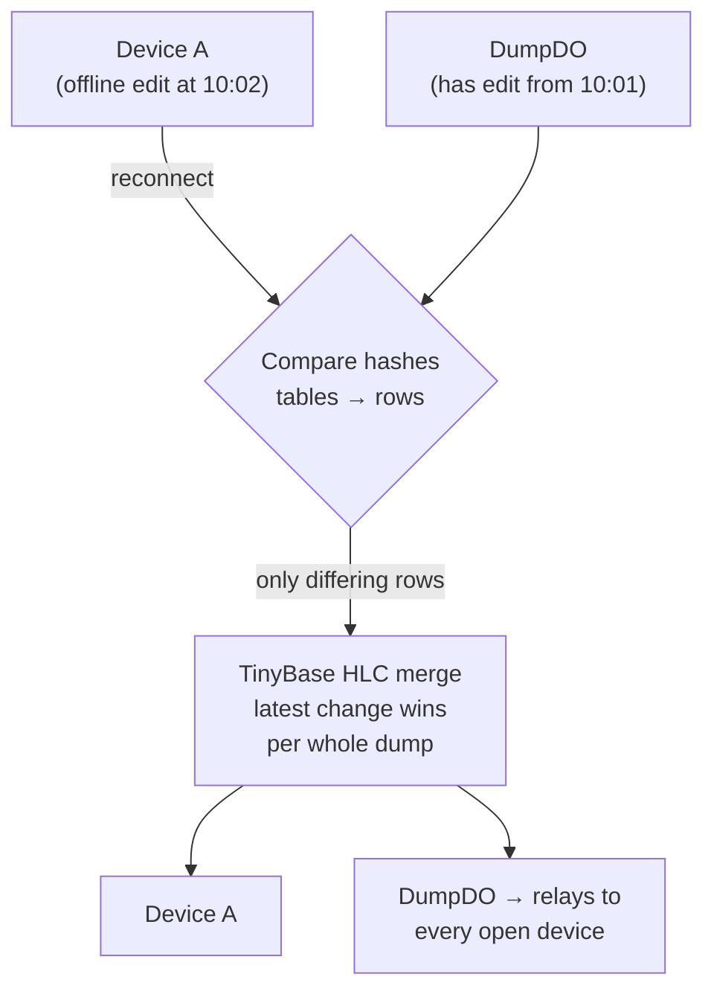

<p align="center">
  
</p>

<h1 align="center">Dump</h1>

A capture-first home for thoughts and links. Type something, press Enter, and it is saved. Organizing it can wait, and with [Jev](#why-jev) switched on the app files it for you.

Dump is built for one person using one device at a time. It is **local-first**: every capture lands on your device right away, then syncs to your other devices through your own server: a single Cloudflare Durable Object. Everyone uses the same web app at **https://dump.abishrestha.com.np** and connects it to a server they deploy themselves, or keeps the notebook on one device.

> **One key per server.** Your server has a single secret, `OWNER_KEY`. Each of your devices enters it once; without it, a server reveals only that it is a Dump server. See [Security model](#security-model).

- [Quick start](#quick-start)
- [Using Dump](#using-dump)
- [Connect your own server](#connect-your-own-server)
- [Mac app](#mac-app)
- [Architecture](#architecture)
- [Why these decisions](#why-these-decisions)
- [Why Jev](#why-jev)
- [Deploy your server](#deploy-your-server)
- [Checks and tests](#checks-and-tests)
- [Limitations and roadmap](#limitations-and-roadmap)

## Quick start

Requires Node.js 22.12+ (tested with Node 24) and npm.

```bash
npm install
npm run dev
```

Open http://localhost:6191. `npm run dev` starts both halves on separate origins, as in production: the web client (Vite, port 6191) and the API server (Wrangler: Worker and Durable Object, port 6190). On first run choose **Get started → Sync with your server**: the local address and the dev server's owner key (`dump-local-development-owner-key`) are prefilled, so choose **Check**, then **Connect to this server**. Local data lives in this browser and in `.wrangler/state`. It is not your production data.

To turn on automatic filing locally, add your Jev key to `.env.local` (gitignored):

```bash
echo "JEV_API_KEY=your-key" >> .env.local
```

## Using Dump

| Action | How |
| --- | --- |
| Capture | Type and press Enter. Shift+Enter adds a new line. `/` focuses the composer. |
| File while capturing | Start with `!list`, for example `!buy warm floor lamp #reading` files to Buy and adds the tag `reading`. |
| Default lists | `!ideas`, `!buy`, `!watch`, `!decor`, `!todo`. For list names with spaces, use hyphens: `!weekend-plans`. |
| Auto-file | With Jev on, other dumps show "Sorting…" briefly, then move to Jev's pick, or to To do when Jev is unsure. If you file a dump first, your choice wins. |
| Search | Ctrl/Cmd+K searches thoughts, links, tags, lists, and navigation. |
| Sort the inbox | `1`–`9` pick a list, Right Arrow skips, Backspace removes. |
| Lists | Create them from the sidebar. Rename, recolor, or delete one with the pencil in the list header. |
| Done / remove | Final: there is no undo. Removal leaves a hidden tombstone so other devices don't bring the dump back. |
| First run | On the landing page, **Get started**: connect your server (address → **Check** → owner key → **Connect**) or keep the notebook on this device only. |
| Server | Settings → Your server: switch servers, connect a device-only notebook to a server, or sign in again after the owner key changes. Saved notebooks reopen offline. |
| Backups | Settings → Export or Import JSON. Import only adds missing records and never overwrites existing ones. |

Every view works like a chat: a header, the dumps (newest at the bottom), and the composer pinned underneath. The composer below a list saves into that list; in the inbox, `!list` or Jev files it. `/marketing` is a separate landing page that doesn't load the notebook.

## Connect your own server

Dump has one web app for everyone, at **https://dump.abishrestha.com.np**, and one server per person. You deploy your own server ([Deploy your server](#deploy-your-server)) and the app talks to it directly. Your notes travel only between your devices and your server; there is no central Dump service or account registry.

Each server is one owner's notebook: one Worker, one SQLite-backed `DumpDO`, still addressed by `idFromName('me')`. It serves only the API, never the UI.

Open the app and choose **Get started → Sync with your server**. Enter your server's full origin (for example `https://dump.<your-subdomain>.workers.dev`), choose **Check**, then enter its owner key and connect. Nothing is saved until the server accepts the key. Your password manager can save the key per server (the address is the username), which makes setting up the next device quick. Change servers later under **Settings → Your server**. HTTPS is required except on localhost for development. Paths, credentials, and query strings are rejected.

Returning visitors go straight to their notebook: the app decides from this browser's own settings, with no redirect and without loading the landing page. New visitors see the landing page at whatever address they opened.

Your server answers only the web app origins listed in its `ALLOWED_CLIENT_ORIGINS` variable (in `wrangler.jsonc`). It lists the hosted app by default, so a fork works with it unchanged:

```jsonc
"vars": {
  "ALLOWED_CLIENT_ORIGINS": "https://dump.abishrestha.com.np"
}
```

To also use a self-hosted copy of the app, add its origin after a comma. Use exact origins without trailing slashes. The allowlist applies to HTTP and WebSocket requests; HTTP preflights are supported. Requests without an `Origin` header, or from any unlisted origin (the server's own included), get 403. This is browser-origin policy, **not authentication**: non-browser callers can send any `Origin`. The owner key is what protects your notebook.

The hosted app's code comes from `dump.abishrestha.com.np`, so using it means trusting whoever deploys it, as with any web app. To remove that dependency, host the app yourself.

### Host your own copy of the web app (optional)

```bash
npm run build:client
```

This writes a static site to `dist/client/`. Point `wrangler.client.jsonc` at your account and domain and deploy it with `npx vp run deploy:client`, or publish `dist/client/` to any static HTTPS host with an SPA fallback to `index.html`. Add that origin to your server's `ALLOWED_CLIENT_ORIGINS`. Client and server deploy independently, but formats remain experimental: update both together when changing contracts. There are no API/schema version numbers or compatibility migrations.

### Keep a notebook on this device only

Choose **Just this device** during setup to skip the server. The notebook lives only in this browser: no sync, no automatic filing, and nothing leaves the device. The app asks the browser to keep its storage, but Safari still clears site data after seven days without a visit unless the app is installed to the home screen, so install it and export backups from Settings. To add a server later, open **Settings → Your server** and connect one; this notebook's thoughts are added to the server's.

### Keep notebooks separate

Each saved connection has its own local database (`dump-v1-<profile-id>`) and BroadcastChannel. Connection settings live in this browser under `dump-connections`.

Switching saves local writes, then reloads the app into the selected notebook; if the save fails, it doesn't switch. Other tabs keep their existing connection until reloaded, and unsubmitted composer text is not carried over. Saved connections open offline and sync when the server is reachable. Nothing moves between notebooks on its own: use export and import.

Each server has a permanent identity that the app remembers. If a different server appears at the same address, or a server moves to a new address, the app keeps the old notebook to itself: connect again in Settings to create a separate notebook.

The [Mac app](#mac-app) reuses the TypeScript client core through its platform adapter contract; Raycast and Android clients could do the same but are not planned soon. Cloudflare is the supported server implementation; VPS/Docker hosting needs a separate adapter.

## Mac app

A menu bar app for capturing from anywhere: press **⇧⌘Space**, type, press Return. Its notebook window (**Open Notebook** in the menu bar icon, or ⌘O in the panel) does what the web app does: the inbox, your lists and Done, search, Sort inbox, marking done, moving, removing, list editing and Clear done. It is the same notebook as the web app (it runs the web app's own client core), so it works offline, files with `!list`, lets Jev sort, and syncs with your server.

Build and install it (needs Xcode with Swift 6, and Node):

```bash
npm run mac:install
```

This builds `mac/build/Dump.app`, copies it to `/Applications`, and opens it. Run it again to update: the running copy saves and quits first. It isn't notarized, so build it on the Mac that runs it rather than sharing the app. To keep Keychain access to your owner key across rebuilds, put your signing identity (`security find-identity -v -p codesigning`) in `mac/.env.local`, which is not committed:

```bash
DUMP_SIGN_IDENTITY="Apple Development: Your Name (TEAMID)"
```

| In the panel | |
| --- | --- |
| Return | Save and close |
| Shift+Return or Option+Return | New line |
| Tab / Shift+Tab, Cmd+0–9 | Choose the list (Cmd+0 is Inbox). A `!list` prefix in the text wins. |
| Escape, or click elsewhere | Close; the draft is kept |
| Cmd+O | Open the notebook window |

| In the notebook window | |
| --- | --- |
| Click, Shift-click, Cmd-click | Select dumps; right-click for every action |
| Space | Mark done, or not done |
| 0–9 | Move to the inbox (0) or a list |
| Delete | Remove (more than one asks first) |
| Return or double-click | Open the link; in a search, show the dump in its list |
| Cmd+F | Search text, `#tags` and list names |
| Shift+Cmd+N | New list |

The composer below a list saves into that list; in the inbox, `!list` or Jev files it. While a window is open, Dump is in the Dock and ⌘Tab with a menu bar of its own (Dump ▸ Settings… is ⌘,); closing its windows makes it a menu bar app again.

The menu bar icon and the gear in the notebook window open Settings: the shortcut, open at login, and your server (address → **Check** → owner key → **Connect and Sync**; notes made on the Mac join the server's notebook). Under Advanced is the web app address the Mac presents to your server. It must be in the server's `ALLOWED_CLIENT_ORIGINS`, which lists the hosted app by default. Notebooks live in `~/Library/Application Support/Dump`, and owner keys in your Keychain.

## Architecture

### The big picture


```mermaid
flowchart LR
    subgraph Device["📱 Each device"]
        direction TB
        UI["React UI"]
        Mem["TinyBase<br/>MergeableStore<br/>(in memory)"]
        IDB[("IndexedDB<br/>per connection")]
        UI -- "capture (sync)" --> Mem
        Mem -- "persist (async)" --> IDB
    end

    subgraph Tabs["Other tabs, same browser"]
        Tab2["TinyBase store"]
    end

    Static["☁️ Hosted web app<br/>static files + service worker<br/>dump.abishrestha.com.np"]

    subgraph CF["☁️ Your server (Cloudflare)"]
        direction TB
        Worker["Worker (Hono)<br/>/api/ping<br/>/api/classify<br/>/api/sync"]
        DO["DumpDO<br/>WsServerDurableObject<br/>idFromName('me')"]
        SQL[("Durable Object<br/>SQLite")]
        Worker -- "WebSocket upgrade" --> DO
        DO -- "fragmented persister" --> SQL
    end

    Jev["Jev<br/>api.typesafe.ai"]

    Static -- "app shell, cached for offline" --> UI
    Mem <-- "BroadcastChannel" --> Tab2
    Mem <-- "WebSocket: hash diff + live edits" --> Worker
    UI -. "POST /api/classify<br/>(after capture)" .-> Worker
    Worker -. "Bearer JEV_API_KEY" .-> Jev
```

There are three layers, and each one can fail without taking the ones before it down:

1. **Memory.** The capture handler writes to the TinyBase store and the UI updates in the same tick. It never waits on disk or the network.
2. **Device.** IndexedDB saves the store asynchronously, so a reload keeps your data even when offline. A failed save shows an error; it is never hidden.
3. **Cloud.** A WebSocket connects the device to one Durable Object. It carries changes both ways and saves them to SQLite.

### What happens when you press Enter


```mermaid
sequenceDiagram
    autonumber
    actor You
    participant UI as React UI
    participant Store as TinyBase store
    participant IDB as IndexedDB
    participant DO as DumpDO (Cloudflare)
    participant W as Worker /api/classify
    participant Jev

    You->>UI: type + Enter
    UI->>Store: setCell(dumps, id, data)
    Store-->>UI: re-render (same tick)
    Note over UI: The dump is already on screen, unfiled, "Sorting…"
    Store-)IDB: persist (async)
    Store-)DO: sync the changed row over WebSocket
    DO-)DO: save to SQLite, relay to other devices
    UI-)W: { text, lists } (queued microtask)
    W->>Jev: one Choice question: list IDs + leave_in_inbox
    Jev-->>W: { choice, confidence }
    W-->>UI: { list, confidence }
    alt confidence ≥ 0.4 and you haven't filed it yet
        UI->>Store: file to Jev's list (classified_by: 'ai')
    else unsure or leave_in_inbox
        UI->>Store: file to To do
    end
    Store-)DO: sync the filing like any other edit
```

If the request fails or you close the tab mid-request, the dump simply stays unfiled. **Unfiled open dumps are the retry queue.** They are sent again on the next load or reconnect, at most three at a time.

### Sync and conflicts


```mermaid
flowchart TB
    A["Device A<br/>(offline edit at 10:02)"] -- reconnect --> H{"Compare hashes<br/>tables → rows"}
    B["DumpDO<br/>(has edit from 10:01)"] --> H
    H -- "only differing rows" --> M["TinyBase HLC merge<br/>latest change wins<br/>per whole dump"]
    M --> A2["Device A"]
    M --> B2["DumpDO → relays to<br/>every open device"]
```

- **Each dump is one atomic JSON cell.** A dump's list, done flag, and provenance merge together, so a conflict picks one whole version and never mixes fields from two edits.
- **TinyBase's hybrid logical clocks decide who wins.** `updated_at` is display metadata only and never competes with the merge clock.
- **Nothing is physically deleted.** Removal sets `deleted: true`, a tombstone that syncs like any edit. Without it, an older copy would bring the dump back.
- **The server doesn't read rows.** It stores and relays them. Every client decodes rows with Zod in `readRows` (`src/shared/merge.ts`) and skips any that fail.

### Code map

```
src/
├── shared/            imported by both client and Worker
│   ├── schema.ts      Zod codecs for dumps, lists, backups; TinyBase table schema
│   ├── merge.ts       store factory, readRows (validated decode), sync tuning
│   ├── classify.ts    Jev request/response mapping, threshold
│   └── api.ts         response schemas for /api/ping and /api/sync-ticket
├── core/              reusable client logic, no React/browser/Worker dependencies
│   ├── client.ts      notebook instance, commands, AI queue, start/stop lifecycle
│   ├── connection.ts  server URL validation, identity checks, storage names
│   ├── server-link.ts one server over fetch + WebSocket (browser and Mac)
│   └── classify.ts    stateless classification HTTP client
├── client/            React app
│   ├── main.tsx       entry: picks notebook or landing page, lazy-loads it
│   ├── store.ts       the active notebook's client, React subscription, export
│   ├── browser-platform.ts  IndexedDB, WebSocket, tab sync, device events
│   ├── profiles.ts    saved notebooks (server or device only) and owner keys
│   ├── registry.ts    has this browser a notebook? decides what / shows
│   ├── boot.ts        holds the loading screen until the notebook is ready
│   ├── App.tsx        notebook shell: sidebar, views, composer
│   ├── Marketing.tsx  lazy landing page with onboarding
│   ├── lib/           viewport.ts (phone keyboard), utils.ts
│   └── components/    cards, search, onboarding, server settings; ui/ = shadcn/Radix
└── server/            Cloudflare Worker, API only
    ├── index.ts       Hono routes, origin checks, owner-key checks, security headers, Jev proxy
    ├── auth.ts        owner key comparison and WebSocket tickets
    ├── origins.ts     client origin allowlist
    ├── dump-do.ts     DumpDO (TinyBase WsServerDurableObject + SQLite persister)
    └── env.ts         Worker bindings
mac/                   menu bar app (Swift); see Mac app
├── engine/            src/core + TinyBase bundled for JavaScriptCore, with web API polyfills
├── Sources/DumpKit/   runs the engine: native timers, HTTP, WebSocket, files, Keychain, profiles
├── Sources/Dump/      AppKit/SwiftUI shell: hotkey, capture panel, notebook window, settings, menu bar
├── Sources/dump-check/  headless sync check against a running server
└── scripts/           build-app.sh (build, sign, --install) and the icon renderer
tests/                 Vitest unit tests + Playwright e2e
public/                _headers (CSP), theme-init.js, icons
docs/                  notes for coding agents, one per area (see AGENTS.md)
wrangler.jsonc         API server deploy config
wrangler.client.jsonc  web client deploy config (static assets only)
```

The client and Worker compile separately (`tsconfig.client.json`, `tsconfig.json`) and build separately: Vite builds only the client into `dist/client/`, and Wrangler bundles the Worker (`npm run build:server` dry-runs it into `dist/server/`). Browser code imports the shared API contract but never Worker implementation types.

## Why these decisions

| Decision | Why | Trade-off accepted |
| --- | --- | --- |
| **Local-first, synchronous capture** | Capture is the whole product. A thought typed in a tunnel or on bad Wi-Fi must appear right away and survive a reload. | Each device has its own copy, so "saved here" and "synced" are shown as separate states. |
| **TinyBase MergeableStore** | CRDT-style merging with hybrid logical clocks is built in, along with IndexedDB and Durable Object persisters and a WebSocket synchronizer. Nothing had to be built by hand. | It merges whole records, not text. Two edits to the same dump pick one winner and never merge character by character. |
| **Built-in WebSocket sync, not a custom protocol** | Peers compare hashes and send only the rows that differ, and live edits reach every open device. An earlier version sent HTTP snapshots and polled; each poll sent the whole store and eventually hit a size limit. | WebSockets are required. There is no HTTP fallback, so changes stay on the device until a working network is available. |
| **One Durable Object (`idFromName('me')`)** | There is one user and one dataset, so one DO is the natural fit. It has strongly consistent SQLite storage, hibernating WebSockets, and no separate database to run. | It doesn't scale to multiple users. That's intentional: no accounts, tenants, D1, Postgres, or KV. |
| **Atomic JSON cell per dump** | Filing and its provenance (`classified_by`) must always change together. | The whole dump is rewritten on every edit, which is fine at this scale. |
| **Tombstones, never `delRow`** | A deleted row would come back from any copy that still has it. | Tombstones accumulate. Compaction needs a deliberate design first. |
| **Latest change wins, including offline edits** | The owner uses one device at a time. Precedence rules and revision checks would add complexity with no real benefit here. | A stale offline device can overwrite a newer change to the same dump. |
| **No undo** | Done, filing, and remove are final. Earlier undo logic could restore unrelated fields and conflicted with sync. | Mistakes are fixed by hand. Removal has a confirm step where it matters (Clear done, delete list). |
| **Validate on read, not on the server** | The sync server relays rows it doesn't understand, which keeps it simple. Clients use Zod to reject malformed data. | A bad row is skipped rather than rejected at the source. |
| **One hosted app, a server per person** | The web app is static files that one host serves to everyone; each person's server is one Worker and DO. Either half redeploys alone, and future Raycast/Android clients use the same API. `npm run dev` still starts both. Zod schemas in `src/shared` are the API contract both sides check. | Two deploys, and every client origin must be listed in `ALLOWED_CLIENT_ORIGINS`. The server is tied to Cloudflare's runtime. |
| **The Mac app runs the web core** | JavaScriptCore runs the same TypeScript client core, so sync, filing, and merge rules can't drift from the web app; Swift supplies only the platform (timers, HTTP, WebSocket, files, Keychain). | A small set of web API polyfills to maintain, and the app must be rebuilt when the core changes. |
| **One owner key, not accounts** | Each server belongs to one person, so a single generated secret covers every device with no sign-up, cookies, or session store. Tokens work across sites, where cookies would not. | Cutting off one lost device means rotating the key and entering the new one on the others. See [Security model](#security-model). |

## Why Jev

[Jev](https://typesafe.ai/blog/introducing-system-one-models-and-jev) is TypeSafe's System One model. Instead of generating text, it answers **constrained questions** such as "which of these options?", and it returns a confidence score with each answer.

That fits Dump's main AI rule: **AI may file, never rewrite.**

| Need | Why Jev fits |
| --- | --- |
| Never change the user's words | Jev can't generate text. It can only choose from the keys we send (list IDs + `leave_in_inbox`). |
| Structured, parseable output | The answer is always one of our IDs plus a confidence. There is no prompt parsing and no JSON repair. |
| Know when it's unsure | The confidence score drives the fallback. Below `CLASSIFY_THRESHOLD` (0.4) the dump goes to To do. |
| Fast enough to feel instant | In live testing it answered in about 400 ms (948 ms cold), and it runs after capture, so it never blocks Enter. |
| Allow "none of these" | `leave_in_inbox` lets Jev decline instead of forcing a bad match. |

**Why a Worker proxy?** Jev's CORS policy rejects browser origins, and the API key must never ship in the bundle. `POST /api/classify` is stateless. It validates `{ text, lists }`, forwards one Choice question, checks the answer against the lists it sent (a list could be deleted during the request), and returns `{ list, confidence }`.

**Why is it optional?** Jev is on exactly when `JEV_API_KEY` is set. Without the key, or with fewer than two lists, dumps stay in the inbox for you to sort, and `/api/ping` reports `classify: false`. E2e servers never call Jev.

**Why does the threshold sit at 0.4?** In early tests, correct Buy/Decor picks came back at 0.60–0.65 confidence. Jev's top pick still beats the To do fallback when it's somewhat unsure. The threshold should be tuned against real labelled dumps.

## Deploy your server

To use Dump you only need your own server: deploy it, then connect https://dump.abishrestha.com.np to it. The owner's own server runs at `https://dump-api.abishrestha.com.np`; the hosted app is deployed from this repository with `deploy:client`.

### Prerequisites

- A Cloudflare account. SQLite-backed Durable Objects are available on the Workers Free plan; check current limits for your usage.
- For a custom domain, a zone (domain) already added to that Cloudflare account.
- Node.js 22.12+ and `npm install` completed.

### 1. Sign in

```bash
npx wrangler login
```

```bash
npx wrangler whoami
```

`whoami` prints your account ID.

### 2. Point `wrangler.jsonc` at your account

Forks must change these fields:

```jsonc
{
  "name": "dump",
  "account_id": "<your account id>",
  "routes": [{ "pattern": "dump.example.com", "custom_domain": true }],
  "vars": { "ALLOWED_CLIENT_ORIGINS": "https://dump.abishrestha.com.np" },
  "workers_dev": false,
  "preview_urls": false,
}
```

- **Custom domain:** set `pattern` to a hostname on a zone you own. Cloudflare creates the DNS record and certificate on deploy.
- **No domain:** remove `routes` and set `"workers_dev": true`. Your server is then at `https://dump.<your-subdomain>.workers.dev`.

Keep `ALLOWED_CLIENT_ORIGINS` as it is to use the hosted app. Leave the `durable_objects` binding and the `migrations` entry (`new_sqlite_classes: ["DumpDO"]`) as they are. They create the SQLite-backed Durable Object class on first deploy.

### 3. Set the owner key

```bash
openssl rand -base64 32
```

```bash
npx wrangler secret put OWNER_KEY
```

Paste the generated value when prompted and keep it in your password manager. Until a key of at least 32 characters is set, the server refuses everything except `/api/ping`. Rotating it later (the same command) signs out every device; each keeps its notes and asks for the new key.

### 4. Optional: enable Jev

```bash
npx wrangler secret put JEV_API_KEY
```

Paste the key when prompted. It is stored as an encrypted Worker secret and never reaches the browser. To turn classification off later:

```bash
npx wrangler secret delete JEV_API_KEY
```

### 5. Deploy

```bash
npx vp run deploy:server
```

The `deploy:server` task (under `run.tasks` in `vite.config.ts`) runs, in order:


```mermaid
flowchart LR
    L[vp lint] --> T[vp test] --> C[tsc client + worker] --> D[wrangler deploy]
```

If any step fails, the deploy stops.

To deploy the web app as well (the hosted app's owner, or your own copy), point `wrangler.client.jsonc` at your account and domain, then run `npx vp run deploy:client`. It runs the same checks, `vp build`, and `wrangler deploy --config wrangler.client.jsonc`. When a change touches the API contract, deploy the server first, then the app.

### 6. Verify

```bash
curl -H 'Origin: https://dump.abishrestha.com.np' https://dump.example.com/api/ping
```

Without an allowed `Origin`, the server answers 403. The response identifies `app: "dump"`, a persistent `instanceId`, `syncProtocol: "tinybase-ws"`, `auth: "owner-key"` (`"unconfigured"` until step 3), `mode: "cloud"`, and `classify: true` (or `false` when no key is configured). Then open https://dump.abishrestha.com.np, choose **Get started**, connect your server with its owner key, and check the following:

- Capture on your phone and confirm it appears on your desktop without a reload.
- Turn on airplane mode, capture, reload (the dump is still there), reconnect (it syncs).
- With Jev on, a new dump shows "Sorting…", then moves into a list.
- Watch logs with `npx wrangler tail`. Observability is enabled in `wrangler.jsonc`.

After a deploy, reload open clients and installed PWAs through the update notice so they pick up the new build.

### Security model

Everything except `/api/ping` needs your server's owner key. HTTP requests send it as `Authorization: Bearer`, and the server compares it in constant time. Browsers cannot set headers on a WebSocket, so the app first calls `POST /api/sync-ticket` for a ticket: the expiry plus an HMAC of it and the notebook ID, signed with the key and valid for 60 seconds. The key itself never appears in a URL or log. Tickets are stateless, so one can be replayed until it expires. `/api/classify` also needs the key and keeps a per-isolate limit of 60 requests a minute. A server without a key of at least 32 characters refuses access.

Each device stores the key in the web app's local storage, next to that notebook. The web app's host sends a Content-Security-Policy (`public/_headers`) that runs only the app's own scripts, which limits what injected code could do with it. To cut off a lost device, rotate the key; your other devices ask for the new one and keep their notes. Anyone who controls the hosted app's code, or your Cloudflare account, can still reach your notebook; host the app yourself if you want to remove the first.

The Worker also answers only origins listed in `ALLOWED_CLIENT_ORIGINS`, for HTTP and WebSocket upgrades, and refuses requests without `Origin`. That is browser policy, not authentication. It sets `nosniff`, `no-referrer`, and `X-Frame-Options: DENY`.

## Checks and tests

```bash
npm run check
```

`check` runs the format check, lint, unit tests, type checks, and both builds (the client, and a dry run of the Worker bundle).

```bash
npx playwright install chromium
```

```bash
npm run test:e2e
```

The e2e suite runs two local API servers and the built web client with its production headers, all on local ports, and never calls Jev. [docs/testing.md](docs/testing.md) describes the setup.

Tooling is [Vite+](https://viteplus.dev): Vite, Vitest, Oxlint, and Oxfmt are all configured in `vite.config.ts`.

The Mac app has its own build and tests:

```bash
npm run mac:engine && (cd mac && swift build && swift test)
```

Other scripts: `npm run format` (`vp fmt`), `npm run lint` (`vp lint` + React Doctor), `npm test` (`vp test`), `npm run typegen` (regenerate Worker binding types).

## Limitations and roadmap

These are true today:

- Sync requires WebSockets. On networks that block them, changes stay on the device until you connect elsewhere.
- Simultaneous edits to the same dump pick one whole winner; there is no collaborative text editing.
- Local dev and production are different origins with separate data. Use Export/Import to move data between them.
- Import is additive: it restores missing IDs and never rewinds existing records, so it is not a full disaster-recovery tool.
- There is no schema versioning yet (the app hasn't reached a stable release), so formats change in place.

Not built yet: list reordering UI, card drag/manual order, list archiving, AI tagging, durable server-side AI jobs, scheduled digest, email capture, R2 backup/restore, link unfurling, advanced gestures, native share extension, Raycast/Android clients, and physical-phone validation.

Coding agents start at [AGENTS.md](AGENTS.md). It maps each area to its notes in `docs/`, and review rules are in [CODING_STANDARDS.md](CODING_STANDARDS.md).
