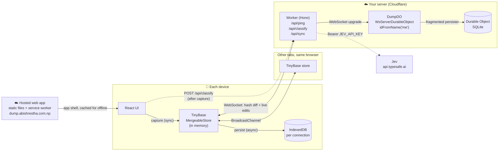
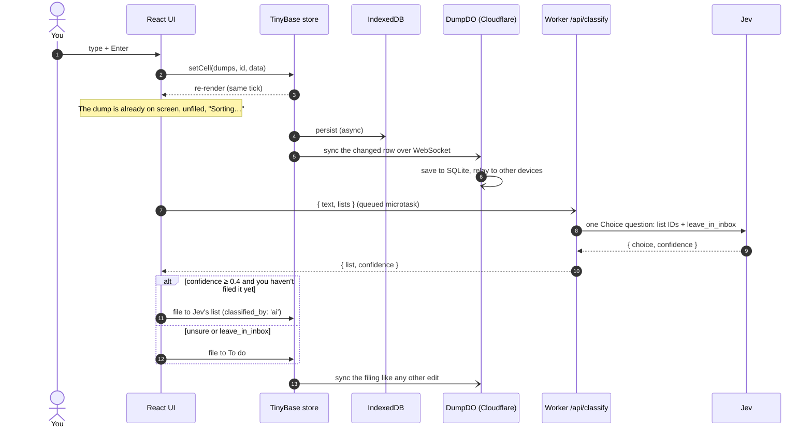
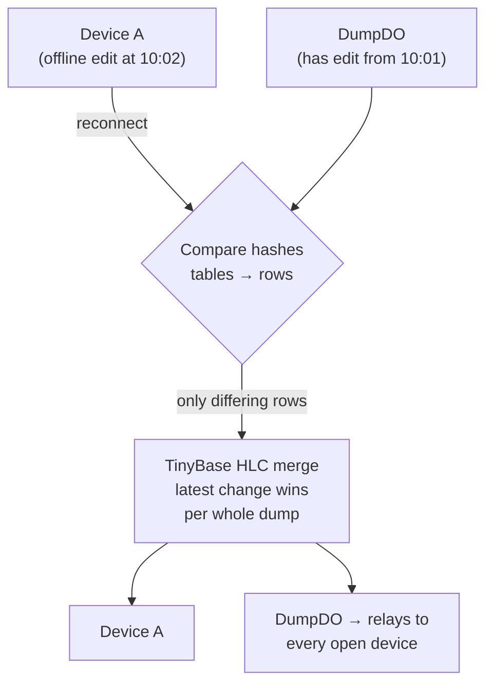

# Architecture

How Dump fits together and why it is built this way. Day-to-day rules for each area are in the docs that [AGENTS.md](../AGENTS.md) maps.

## The big picture



There are three layers, and each one can fail without taking the ones before it down:

1. **Memory.** The capture handler writes to the TinyBase store and the UI updates in the same tick. It never waits on disk or the network.
2. **Device.** IndexedDB saves the store asynchronously, so a reload keeps your data even when offline. A failed save shows an error; it is never hidden.
3. **Cloud.** A WebSocket connects the device to one Durable Object. It carries changes both ways and saves them to SQLite.

## What happens when you press Enter



If the request fails or you close the tab mid-request, the dump simply stays unfiled. **Unfiled open dumps are the retry queue.** They are sent again on the next load or reconnect, at most three at a time.

## Sync and conflicts



- **Each dump is one atomic JSON cell.** A dump's list, done flag, and provenance merge together, so a conflict picks one whole version and never mixes fields from two edits.
- **TinyBase's hybrid logical clocks decide who wins.** `updated_at` is display metadata only and never competes with the merge clock.
- **Nothing is physically deleted.** Removal sets `deleted: true`, a tombstone that syncs like any edit. Without it, an older copy would bring the dump back.
- **The server doesn't read rows.** It stores and relays them. Every client decodes rows with Zod in `readRows` (`src/shared/merge.ts`) and skips any that fail.

## Code map

```
src/
├── shared/            imported by both client and Worker
│   ├── schema.ts      Zod codecs for dumps, lists, backups; TinyBase table schema
│   ├── merge.ts       store factory, readRows (validated decode), sync tuning
│   ├── classify.ts    Jev request/response mapping, threshold
│   └── api.ts         response schemas for /api/ping and /api/sync-ticket
├── core/              reusable client logic, no React/browser/Worker dependencies
│   ├── client.ts      notebook instance, commands, AI queue, start/stop lifecycle
│   ├── connection.ts  server URL validation, identity checks, storage names
│   ├── server-link.ts one server over fetch + WebSocket (browser and Mac)
│   └── classify.ts    stateless classification HTTP client
├── client/            React app
│   ├── main.tsx       entry: picks notebook or landing page, lazy-loads it
│   ├── store.ts       the active notebook's client, React subscription, export
│   ├── browser-platform.ts  IndexedDB, WebSocket, tab sync, device events
│   ├── profiles.ts    saved notebooks (server or device only) and owner keys
│   ├── registry.ts    has this browser a notebook? decides what / shows
│   ├── boot.ts        holds the loading screen until the notebook is ready
│   ├── App.tsx        notebook shell: sidebar, views, composer
│   ├── Marketing.tsx  lazy landing page with onboarding
│   ├── lib/           viewport.ts (phone keyboard), utils.ts
│   └── components/    cards, search, onboarding, server settings; ui/ = shadcn/Radix
└── server/            Cloudflare Worker, API only
    ├── index.ts       Hono routes, origin checks, owner-key checks, security headers, Jev proxy
    ├── auth.ts        owner key comparison and WebSocket tickets
    ├── origins.ts     client origin allowlist
    ├── dump-do.ts     DumpDO (TinyBase WsServerDurableObject + SQLite persister)
    └── env.ts         Worker bindings
mac/                   menu bar app (Swift); see docs/mac.md
├── engine/            src/core + TinyBase bundled for JavaScriptCore, with web API polyfills
├── Sources/DumpKit/   runs the engine: native timers, HTTP, WebSocket, files, Keychain, profiles
├── Sources/Dump/      AppKit/SwiftUI shell: hotkey, capture panel, notebook window, settings, menu bar
├── Sources/dump-check/  headless sync check against a running server
└── scripts/           build-app.sh (build, sign, --install) and the icon renderer
tests/                 Vitest unit tests + Playwright e2e
public/                _headers (CSP), theme-init.js, icons
docs/                  notes for coding agents, one per area (see AGENTS.md)
wrangler.jsonc         API server deploy config
wrangler.client.jsonc  web client deploy config (static assets only)
```

The client and Worker compile separately (`tsconfig.client.json`, `tsconfig.json`) and build separately: Vite builds only the client into `dist/client/`, and Wrangler bundles the Worker (`npm run build:server` dry-runs it into `dist/server/`). Browser code imports the shared API contract but never Worker implementation types.

## Why these decisions

| Decision | Why | Trade-off accepted |
| --- | --- | --- |
| **Local-first, synchronous capture** | Capture is the whole product. A thought typed in a tunnel or on bad Wi-Fi must appear right away and survive a reload. | Each device has its own copy, so "saved here" and "synced" are shown as separate states. |
| **TinyBase MergeableStore** | CRDT-style merging with hybrid logical clocks is built in, along with IndexedDB and Durable Object persisters and a WebSocket synchronizer. Nothing had to be built by hand. | It merges whole records, not text. Two edits to the same dump pick one winner and never merge character by character. |
| **Built-in WebSocket sync, not a custom protocol** | Peers compare hashes and send only the rows that differ, and live edits reach every open device. An earlier version sent HTTP snapshots and polled; each poll sent the whole store and eventually hit a size limit. | WebSockets are required. There is no HTTP fallback, so changes stay on the device until a working network is available. |
| **One Durable Object (`idFromName('me')`)** | There is one user and one dataset, so one DO is the natural fit. It has strongly consistent SQLite storage, hibernating WebSockets, and no separate database to run. | It doesn't scale to multiple users. That's intentional: no accounts, tenants, D1, Postgres, or KV. |
| **Atomic JSON cell per dump** | Filing and its provenance (`classified_by`) must always change together. | The whole dump is rewritten on every edit, which is fine at this scale. |
| **Tombstones, never `delRow`** | A deleted row would come back from any copy that still has it. | Tombstones accumulate. Compaction needs a deliberate design first. |
| **Latest change wins, including offline edits** | The owner uses one device at a time. Precedence rules and revision checks would add complexity with no real benefit here. | A stale offline device can overwrite a newer change to the same dump. |
| **No undo** | Done, filing, and remove are final. Earlier undo logic could restore unrelated fields and conflicted with sync. | Mistakes are fixed by hand. Removal has a confirm step where it matters (Clear done, delete list). |
| **Validate on read, not on the server** | The sync server relays rows it doesn't understand, which keeps it simple. Clients use Zod to reject malformed data. | A bad row is skipped rather than rejected at the source. |
| **One hosted app, a server per person** | The web app is static files that one host serves to everyone; each person's server is one Worker and DO. Either half redeploys alone, and future Raycast/Android clients use the same API. `npm run dev` still starts both. Zod schemas in `src/shared` are the API contract both sides check. | Two deploys, and every client origin must be listed in `ALLOWED_CLIENT_ORIGINS`. The server is tied to Cloudflare's runtime. |
| **The Mac app runs the web core** | JavaScriptCore runs the same TypeScript client core, so sync, filing, and merge rules can't drift from the web app; Swift supplies only the platform (timers, HTTP, WebSocket, files, Keychain). | A small set of web API polyfills to maintain, and the app must be rebuilt when the core changes. |
| **One owner key, not accounts** | Each server belongs to one person, so a single generated secret covers every device with no sign-up, cookies, or session store. Tokens work across sites, where cookies would not. | Cutting off one lost device means rotating the key and entering the new one on the others. See [Security](../README.md#security). |

## Why Jev

[Jev](https://typesafe.ai/blog/introducing-system-one-models-and-jev) is TypeSafe's System One model. Instead of generating text, it answers **constrained questions** such as "which of these options?", and it returns a confidence score with each answer.

That fits Dump's main AI rule: **AI may file, never rewrite.**

| Need | Why Jev fits |
| --- | --- |
| Never change the user's words | Jev can't generate text. It can only choose from the keys we send (list IDs + `leave_in_inbox`). |
| Structured, parseable output | The answer is always one of our IDs plus a confidence. There is no prompt parsing and no JSON repair. |
| Know when it's unsure | The confidence score drives the fallback. Below `CLASSIFY_THRESHOLD` (0.4) the dump goes to To do. |
| Fast enough to feel instant | In live testing it answered in about 400 ms (948 ms cold), and it runs after capture, so it never blocks Enter. |
| Allow "none of these" | `leave_in_inbox` lets Jev decline instead of forcing a bad match. |

**Why a Worker proxy?** Jev's CORS policy rejects browser origins, and the API key must never ship in the bundle. `POST /api/classify` is stateless. It validates `{ text, lists }`, forwards one Choice question, checks the answer against the lists it sent (a list could be deleted during the request), and returns `{ list, confidence }`.

**Why is it optional?** Jev is on exactly when `JEV_API_KEY` is set. Without the key, or with fewer than two lists, dumps stay in the inbox for you to sort, and `/api/ping` reports `classify: false`. E2e servers never call Jev.

**Why does the threshold sit at 0.4?** In early tests, correct Buy/Decor picks came back at 0.60–0.65 confidence. Jev's top pick still beats the To do fallback when it's somewhat unsure. The threshold should be tuned against real labelled dumps.
